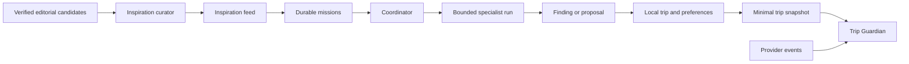

# Voya Agent Architecture

Voya's agent layer turns a local-first itinerary into four connected product experiences:

1. **Inspiration Agent** curates verified reasons to travel and turns “I want this” into a mission.
2. **Mission Board** stores outcomes that Voya should keep working on instead of treating every interaction as a one-shot chat.
3. **Specialist Agents** provide bounded roles for live changes, routing, booking completeness, recovery, discovery, concierge work, and trip-wide coordination.
4. **Trip Guardian** evaluates the current journey as a whole and surfaces only meaningful weak points.

## Runtime Shape

The confirmed itinerary remains owned by SwiftData on the device. Agent requests contain only the fields required for the current task. Missions are cached locally for offline continuity and mirrored to Upstash Redis when backend storage is configured.

## API Surface

### `GET/POST /api/inspiration`

Returns a small editorial feed. `POST` accepts a mood and uses AI only to rank supplied, verified candidates. The model cannot invent destinations, events, dates, prices, or source URLs. A deterministic curated feed is returned when OpenAI is unavailable.

### `GET/POST/PATCH/DELETE /api/missions`

Creates and tracks long-running user outcomes. Missions are scoped to the anonymous installation identifier and expire from operational storage after 180 days.

### `POST /api/guardian`

Accepts a minimal trip snapshot and performs deterministic checks for missing timing, booking evidence, cancellation states, and tight connections. It returns findings attributed to Sentinel, Navigator, Clerk, or Coordinator. Provider-backed live checks continue to use the existing flight, weather, and mobility services.

### `POST /api/specialist-agents`

Runs one bounded specialist against supplied context. The prompt forbids claims that an external action was performed and marks actions involving money, cancellation, communication, or reservations as approval-required.

## Specialist Responsibilities

| Agent | Responsibility |
| --- | --- |
| Sentinel | Flight, weather, status changes, and disruption signals |
| Navigator | Transfers, route timing, buffers, and connections |
| Clerk | Booking completeness, documents, and missing fields |
| Scout | Inspiration, events, nature, and candidate discovery |
| Recovery | Plan B and downstream impact after disruption |
| Concierge | Contextual suggestions during a journey |
| Coordinator | Mission routing and trip-wide impact |

## Autonomy Boundary

The current implementation supports **observe**, **advise**, and **prepare**. It does not purchase, cancel, message a provider, change a reservation, or spend money. Those capabilities require a later proposal-and-approval layer with explicit scopes, idempotency keys, audit records, and expiry.

## Production Evolution

The current Redis mission store is suitable for the account-free MVP. PostgreSQL becomes appropriate when Voya adds multi-device accounts, collaborative trips, long-lived travel memory, mission history, or subscriptions. Inspiration candidates should later be supplied by provider adapters and an editorial review queue; AI should remain the curator and storyteller, not the source of truth.
