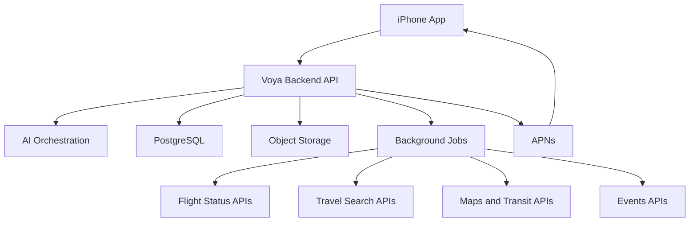

# Voya Architecture

## Architecture Decision

Voya starts as a native iPhone app backed by a server-side travel intelligence layer.

The iPhone app owns the user experience, local trip state, imports, review flows, and notifications. The backend owns AI orchestration, provider integrations, file processing, background monitoring, and secure access to third-party APIs.

## High-Level Shape



## Frontend

The first client is a native iPhone app.

Recommended stack:

- SwiftUI for UI
- Swift concurrency for networking
- SwiftData or Core Data for local cache
- DocumentPicker, PhotosPicker, and Share Extension for manual imports
- APNs for push notifications
- MapKit for native map presentation

Primary app modules:

- Inspire
- Trips
- Import
- Review Extracted Data
- Live Assistant
- Profile and Preferences

## Backend

The backend should exist from the beginning. It keeps API keys off device, runs background monitoring, handles AI extraction, stores source files, and normalizes third-party provider responses.

Recommended starting stack:

- TypeScript backend
- Fastify or NestJS
- PostgreSQL
- S3-compatible object storage
- Redis and BullMQ for background jobs
- Sign in with Apple for authentication
- APNs for notifications

## Domain Model

Core domains:

- users
- preferences
- trips
- itinerary items
- documents
- extractions
- recommendations
- alerts
- providers

Core entities:

- User
- Trip
- ItineraryItem
- Document
- ExtractionResult
- FlightSegment
- AccommodationStay
- EventReservation
- TransitPlan
- Alert
- Recommendation

## Itinerary Data Model

`ItineraryItem` should be the universal container for confirmed trip items.

```text
ItineraryItem
- id
- tripId
- type: flight | hotel | event | train | bus | car | tour | note
- title
- startsAt
- endsAt
- location
- sourceDocumentId
- confidence
- status
- rawData
- normalizedData
```

Type-specific details live in `normalizedData`, while the shared fields power the timeline and reminders.

## Three Separate States

Voya should keep these states separate:

1. Raw document
2. AI extraction result
3. Confirmed itinerary item

This is the most important reliability boundary in the product. AI can be uncertain, users can correct extracted fields, and the confirmed itinerary remains clean.

## AI Pipelines

### Trip Inspiration Pipeline

1. User describes the desired trip.
2. AI converts natural language into structured intent.
3. Backend calls travel search, events, maps, weather, and other data providers.
4. AI ranks and explains a small set of options.
5. User opens external booking links on the platforms they trust.

### Confirmation Parsing Pipeline

1. User uploads a PDF, screenshot, photo, file, or pasted text.
2. Backend stores the original source.
3. Extraction layer reads text or performs OCR.
4. AI classifies the document type.
5. AI extracts structured JSON.
6. Validators check dates, airports, flight numbers, addresses, and required fields.
7. User reviews uncertain fields.
8. Confirmed data becomes itinerary items.

### Trip Support Pipeline

1. Background jobs monitor upcoming itinerary items.
2. Provider adapters fetch flight status, route timing, and other live data.
3. Backend compares new state with stored state.
4. Meaningful changes produce alerts.
5. APNs delivers push notifications.
6. AI explains the impact and suggests next actions.

## Background Jobs

Initial job types:

- document extraction
- flight status refresh
- alert generation
- push delivery
- time-to-leave calculation
- transit route refresh
- recommendation refresh

Flight monitoring should become more frequent as departure approaches.

Example cadence:

```text
More than 48 hours away: every 6-12 hours
48 to 6 hours away: every 1-3 hours
Less than 6 hours away: every 10-30 minutes
After departure: monitor until arrival or cancellation
```

## API Surface

REST is enough for the first version.

Suggested endpoints:

```text
POST /auth/apple
GET /me
PATCH /me/preferences

GET /trips
POST /trips
GET /trips/:id
PATCH /trips/:id

POST /documents
POST /documents/:id/extract
GET /extractions/:id
POST /extractions/:id/confirm

GET /trips/:id/itinerary
POST /trips/:id/itinerary
PATCH /itinerary-items/:id

POST /inspiration/search
GET /recommendations/:id

GET /trips/:id/alerts
POST /push/register-device
```

## Provider Strategy

Voya should hide external provider differences behind internal provider adapters.

Provider categories:

- flight search and inspiration
- flight status
- hotel search and pricing
- event discovery
- maps and transit
- weather
- visa and travel context

Each adapter should normalize data into Voya-owned models. The product should not leak provider-specific shapes into iOS.

## Suggested Build Order

1. Auth and user profile
2. Trips and itinerary model
3. Manual document upload
4. AI extraction pipeline
5. Review and confirm flow
6. Flight status monitoring
7. Push notifications
8. Inspiration search
9. Maps and transit routing
10. Events discovery

## Non-Goals

- direct booking
- payments
- booking changes or refunds
- inbox access
- automatic email scanning
- acting as an online travel agency

## Open Technical Decisions

- Exact backend framework: Fastify or NestJS
- Initial flight status provider
- Initial flight and hotel search provider
- Object storage provider
- OCR provider and fallback strategy
- Whether local-first trip cache uses SwiftData or Core Data
- How much AI work can safely be streamed to the app
