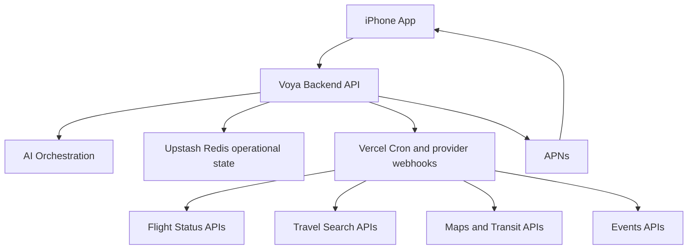

# Voya Architecture

## Architecture Decision

Voya is a native iPhone app backed by Vercel Functions. The production MVP remains local-first and account-free: SwiftData owns the confirmed itinerary on the device, while Upstash Redis stores only short-lived operational state for rate limits, APNs registrations, flight/weather watches, and deduplication.

The iPhone app owns the user experience, local trip state, imports, review flows, and notifications. The backend owns AI orchestration, provider integrations, file processing, background monitoring, and secure access to third-party APIs.

## High-Level Shape



## Frontend

The first client is a native iPhone app.

Recommended stack:

- SwiftUI for UI
- Swift concurrency for networking
- SwiftData or Core Data for local cache
- DocumentPicker, PhotosPicker, and Share Extension for manual imports
- APNs for push notifications
- MapKit for native map presentation

Current release modules:

- Trips
- Import
- Review Extracted Data
- Live Assistant

Current iOS source organization:

- `App`: app entry point and root tab shell
- `Core/Models`: SwiftData and shared domain models
- `Core/Services`: reusable domain services
- `Core/Utilities`: date/string helpers and other small shared utilities
- `Core/DesignSystem`: shared visual components, colors, and app chrome
- `Data`: app store, API clients, cache, and fixtures
- `Features`: screen-level feature modules such as Trips, Import, and Assistant; the unused Inspire source remains outside the release navigation
- `Notifications`: local notification scheduling and reminder logic

`VoyaStore` is intentionally kept as a thin observable state container. Its behavior is split into focused extensions under `Data/Store`:

- persistence and notification sync
- hero image loading
- import, extraction, and flight enrichment
- trip and itinerary editing
- merge and deduplication rules
- itinerary sorting
- trip title/date/summary metadata

Large SwiftUI screens should follow the same pattern: keep the screen container focused on state and actions, and move reusable cards, panels, and renderers into neighboring feature component files.

## Backend

The backend should exist from the beginning. It keeps API keys off device, runs background monitoring, handles AI extraction, stores source files, and normalizes third-party provider responses.

Current production stack:

- TypeScript Vercel Functions
- Upstash Redis for ephemeral operational state
- Vercel Cron for weather monitoring
- FlightAware webhooks for flight changes
- APNs for notifications

PostgreSQL, object storage, Sign in with Apple, and a user profile are intentionally deferred until the product needs multi-device sync, collaboration, server-owned trip history, or subscriptions. They are not required for the account-free MVP.

## Domain Model

Core domains:

- users
- preferences
- trips
- itinerary items
- documents
- extractions
- recommendations
- alerts
- providers

Core entities:

- User
- Trip
- ItineraryItem
- Document
- ExtractionResult
- FlightSegment
- AccommodationStay
- EventReservation
- TransitPlan
- Alert
- Recommendation

## Itinerary Data Model

`ItineraryItem` should be the universal container for confirmed trip items.

```text
ItineraryItem
- id
- tripId
- type: flight | hotel | event | train | bus | car | tour | note
- title
- startsAt
- endsAt
- location
- sourceDocumentId
- confidence
- status
- rawData
- normalizedData
```

Type-specific details live in `normalizedData`, while the shared fields power the timeline and reminders.

## Three Separate States

Voya should keep these states separate:

1. Raw document
2. AI extraction result
3. Confirmed itinerary item

This is the most important reliability boundary in the product. AI can be uncertain, users can correct extracted fields, and the confirmed itinerary remains clean.

## AI Pipelines

### Trip Inspiration Pipeline

1. User describes the desired trip.
2. AI converts natural language into structured intent.
3. Backend calls travel search, events, maps, weather, and other data providers.
4. AI ranks and explains a small set of options.
5. User opens external booking links on the platforms they trust.

### Confirmation Parsing Pipeline

1. User uploads a PDF, screenshot, photo, file, or pasted text.
2. Backend stores the original source.
3. Extraction layer reads text or performs OCR.
4. AI classifies the document type.
5. AI extracts structured JSON.
6. Validators check dates, airports, flight numbers, addresses, and required fields.
7. User reviews uncertain fields.
8. Confirmed data becomes itinerary items.

### Trip Support Pipeline

1. Background jobs monitor upcoming itinerary items.
2. Provider adapters fetch flight status, route timing, and other live data.
3. Backend compares new state with stored state.
4. Meaningful changes produce alerts.
5. APNs delivers push notifications.
6. AI explains the impact and suggests next actions.

## Background Jobs

Initial job types:

- document extraction
- flight status refresh
- alert generation
- push delivery
- time-to-leave calculation
- transit route refresh
- transfer plan refresh
- route option diffing
- recommendation refresh

Flight monitoring should become more frequent as departure approaches.

Example cadence:

```text
More than 48 hours away: every 6-12 hours
48 to 6 hours away: every 1-3 hours
Less than 6 hours away: every 10-30 minutes
After departure: monitor until arrival or cancellation
```

## API Surface

REST is enough for the first version.

Suggested endpoints:

```text
POST /auth/apple
GET /me
PATCH /me/preferences

GET /trips
POST /trips
GET /trips/:id
PATCH /trips/:id

POST /documents
POST /documents/:id/extract
GET /extractions/:id
POST /extractions/:id/confirm

GET /trips/:id/itinerary
POST /trips/:id/itinerary
PATCH /itinerary-items/:id

GET /trips/:id/alerts
POST /push/register-device

POST /mobility
```

`POST /mobility` should remain provider-neutral. The first implementation can call Google Routes API, but the response should expose Voya-owned `RouteOption` and `MobilityRecommendation` shapes rather than Google payloads.

## Provider Strategy

Voya should hide external provider differences behind internal provider adapters.

Provider categories:

- flight status
- hotel search and pricing
- event discovery
- maps and transit
- weather
- visa and travel context

Each adapter should normalize data into Voya-owned models. The product should not leak provider-specific shapes into iOS.

Flight services need a specific split between confirmation import, live status monitoring, predictive scoring, and alerts. See [Flight Services Strategy](flight-services.md) for the recommended MVP provider stack and normalized flight snapshot model.

Mobility services need a similar split between provider routing, Voya-owned transfer recommendations, time-to-leave buffers, regional provider selection, and native map handoff. See [Mobility Services Strategy](mobility-services.md) for the recommended production provider stack and normalized transfer model.

## Suggested Build Order

1. Trips and itinerary model
2. Manual document import
3. AI extraction pipeline
4. Review and confirm flow
5. Flight status monitoring and callbacks
6. Weather monitoring and push notifications
7. Maps and transit routing
8. Events discovery
9. Production hardening and TestFlight

## Non-Goals

- direct booking
- payments
- booking changes or refunds
- inbox access
- automatic email scanning
- acting as an online travel agency

## Deferred Technical Decisions

- Initial flight and hotel search provider
- Object storage provider if server-owned documents are introduced
- Account and sync model if multi-device access is introduced
- App Attest rollout for cryptographic client integrity
- How much AI work can safely be streamed to the app
