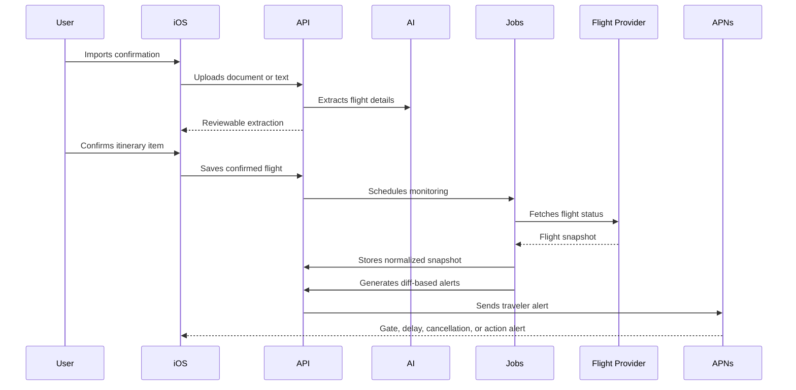

# Flight Services Strategy

## Goal

Voya should support travelers after they manually import a flight confirmation.

The flight layer needs to answer five product questions:

- Is this a real booked flight in the user's itinerary?
- What is the current flight status?
- Has the departure, arrival, terminal, gate, or baggage information changed?
- How likely is the flight to leave or arrive on time?
- What should the traveler do next?

## Important Boundary

Voya should not claim that it can independently confirm a passenger's booking unless it has access to the booking source that created the reservation.

For the MVP, "confirmed booking" means:

1. The user imported a confirmation document.
2. AI extraction found flight details with sufficient confidence.
3. The user reviewed and confirmed the itinerary item.
4. A flight-status provider validates that the flight number, route, and scheduled date exist.

True PNR or ticket validation needs an airline, OTA, NDC, GDS, or booking-provider integration. That is a later partnership track, not a generic public flight-status API feature.

## Recommended MVP Provider Stack

### 1. Confirmation Import

Use the existing OpenAI extraction pipeline as the source of booking details from PDFs, screenshots, photos, files, and pasted text.

Extract and store:

- airline and flight number
- operating carrier, if different
- departure and arrival airports
- scheduled departure and arrival times
- booking reference, if visible
- ticket number, if visible
- passenger name, if visible
- cabin, seat, terminal, and gate, if visible
- extraction confidence and warnings

The booking reference and ticket number should be treated as sensitive data. Store only when needed, redact from logs, and avoid sending them to flight-status providers unless a provider explicitly supports secure booking lookup.

### 2. Flight Status and Change Tracking

Start with FlightAware AeroAPI as the first live flight-status provider.

Why it fits the MVP:

- On-demand flight status and tracking APIs.
- Current and historical flight data.
- Real-time alerting for meaningful events on paid commercial tiers.
- Global flight tracking coverage.
- Foresight predictions can be added later through the same vendor path.

Initial normalized capabilities:

- flight existence validation
- scheduled, estimated, and actual departure/arrival times
- flight status such as scheduled, delayed, departed, arrived, cancelled, diverted
- airport delay context
- flight position and track, if useful for the live trip screen
- provider alerts for departure, arrival, cancellation, diversion, or holding patterns where available

Implementation note: gate and terminal fields should be represented in Voya's model, but treated as optional because availability varies by airport, airline, and provider tier.

### 3. On-Time Probability

Use a two-stage approach:

1. MVP: derive a simple confidence score from provider status, delay minutes, airport delay state, route history if available, weather context, aircraft inbound status when available, and time until departure.
2. Later: upgrade to a paid predictive feed such as FlightAware Foresight, Cirium, or OAG when the app needs stronger on-time performance and commercial SLAs.

The UI copy should be careful:

- Use "Looks likely to depart on time" instead of "Will depart on time".
- Show the reason, such as "no current delay, airport normal, aircraft appears on schedule".
- Add "Prediction may change" for flights more than a few hours away.

### 4. Gate, Terminal, and Delay Alerts

Voya should generate alerts from state diffs, not from raw provider responses.

Persist the last normalized flight snapshot. On each refresh:

- compare status
- compare scheduled, estimated, and actual times
- compare departure and arrival terminal
- compare departure and arrival gate
- compare baggage claim, if present
- compare cancellation or diversion state

Create an alert only when the change is meaningful to the traveler. For example:

- gate changed
- terminal changed
- departure delayed by 15 minutes or more
- flight cancelled
- flight diverted
- boarding or departure is approaching
- connection risk increased

### 5. General Flight Information

The itinerary and flight detail screen should expose:

- airline and flight number
- route
- aircraft, if available
- scheduled, estimated, and actual times
- terminal and gate
- flight status
- delay duration
- baggage claim
- confirmation source
- last provider refresh time
- provider attribution where required by contract

## Internal Model

Add a normalized `FlightSnapshot` on the backend. The iOS app should not consume provider-specific payloads.

```text
FlightSnapshot
- id
- itineraryItemId
- provider
- providerFlightId
- airlineCode
- flightNumber
- operatingAirlineCode
- originAirport
- destinationAirport
- scheduledDepartureAt
- scheduledArrivalAt
- estimatedDepartureAt
- estimatedArrivalAt
- actualDepartureAt
- actualArrivalAt
- departureTerminal
- departureGate
- arrivalTerminal
- arrivalGate
- baggageClaim
- status
- delayMinutes
- cancellationReason
- diversionAirport
- onTimeProbability
- confidence
- sourceUpdatedAt
- fetchedAt
- rawProviderPayload
```

The app can then render a compact traveler-facing status:

```text
FlightLiveState
- headline
- statusTone: normal | watch | action
- primaryTime
- secondaryTime
- gateLabel
- terminalLabel
- onTimeLabel
- lastUpdatedLabel
```

## Backend Flow



## Refresh Cadence

Use provider webhooks or alert callbacks when available. Keep polling as a fallback.

```text
More than 72 hours away: every 12-24 hours
72 to 24 hours away: every 6-12 hours
24 to 6 hours away: every 1-3 hours
6 hours to departure: every 10-30 minutes
After departure: every 10-30 minutes until arrival or cancellation
After arrival: stop monitoring after baggage/arrival state stabilizes
```

## Provider Evaluation Matrix

| Provider | Best Use | Strengths | Watchouts |
| --- | --- | --- | --- |
| FlightAware AeroAPI | MVP live flight status and alerts | On-demand status, tracking, airport delays, alerts, historical data, path to Foresight | Commercial use requires paid tiers; gate/terminal availability should be verified in contract and test data |
| FlightAware Foresight | Later predictive upgrade | Predictive ETA, taxi-out, arrival runway, and gate-arrival prediction data | Premium/enterprise path, not needed for first prototype |
| Cirium / FlightStats | Enterprise-grade status and OTP | Strong aviation data brand, schedules/status/performance products | Usually sales-led; validate pricing and app redistribution rights |
| OAG | Enterprise schedules, status, and OTP | Strong schedule and on-time performance datasets | Usually sales-led; likely heavier than MVP |
| Amadeus Self-Service APIs | Flight search/inspiration and some air data | Useful for travel search and self-service developer onboarding | Not enough by itself for rich live disruption support |
| Duffel | Booking-source validation if Voya later sells/creates bookings | Can validate orders created through Duffel | Does not validate arbitrary bookings made elsewhere |

## Recommendation

For the first production version:

1. Keep manual confirmation import as the booking proof.
2. Add a backend `FlightStatusProvider` interface.
3. Implement `FlightAwareAeroApiProvider` first.
4. Store normalized snapshots and generate alerts from diffs.
5. Represent on-time probability as a cautious Voya score until a paid predictive feed is justified.
6. Revisit Cirium, OAG, and Foresight when Voya has enough active monitored flights to justify enterprise pricing.

## Implemented API Slice

The initial Vercel slice exposes:

```text
GET /api/flight-status
POST /api/flight-status
POST /api/booking-validation
```

`/api/flight-status` accepts:

```json
{
  "flightNumber": "BA2490",
  "date": "2026-08-12",
  "originAirport": "LHR",
  "destinationAirport": "FCO"
}
```

It returns a provider-neutral response with:

- flight existence validation
- normalized flight snapshot
- delay headline and cautious on-time probability
- aircraft position when the provider exposes a track
- terminal, gate, arrival gate, and baggage claim when available
- gate guidance copy that is careful about airport-display authority
- next actions for cancellation, delay, missing gate, or normal travel

`/api/booking-validation` combines the imported confirmation evidence, extraction confidence, user review, and the live provider response. It intentionally returns `canValidatePnr: false` because public flight-status feeds do not prove that the passenger's PNR or ticket is active.

Set `FLIGHTAWARE_AEROAPI_KEY` in Vercel to enable the FlightAware AeroAPI provider. Voya no longer uses aviationstack for flight status because weak plan boundaries made it too easy to show an unrelated flight.

The adapter requests FlightAware flight status data by flight ident and service-date window, then accepts a result only when the provider flight matches the imported route and date. It normalizes:

- FlightAware flight id, IATA/ICAO ident, operator, codeshares, and aircraft registration/type
- origin and destination airport codes
- scheduled, estimated, and actual gate-out, takeoff, landing, and gate-in times
- departure and arrival terminal/gate, baggage claim, and delay fields
- cancellation, diversion, progress, inbound aircraft id, filed route, route distance, altitude, airspeed, and filed ETE
- track/position data when available
- FlightAware alert support metadata, `GET/POST/DELETE /api/flightaware-alert-subscriptions` for AeroAPI `/alerts` management, and `POST /api/flightaware-alerts` as Voya's callback receiver

Without `FLIGHTAWARE_AEROAPI_KEY`, both status endpoints return a graceful `provider_not_connected` state.

## Source Links

- FlightAware AeroAPI: https://www.flightaware.com/commercial/aeroapi/
- FlightAware Foresight: https://www.flightaware.com/commercial/foresight/
- OAG flight status and on-time performance data: https://www.oag.com/flight-status-data
- Amadeus Flight Order Management API: https://developers.amadeus.com/self-service/category/flights/api-doc/flight-order-management/api-reference
- Flightradar24 how it works: https://www.flightradar24.com/how-it-works
